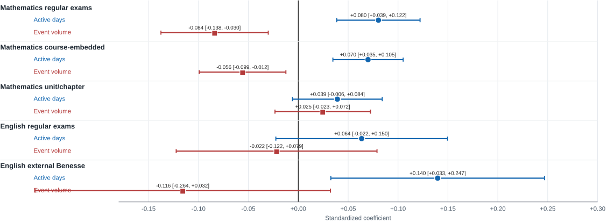
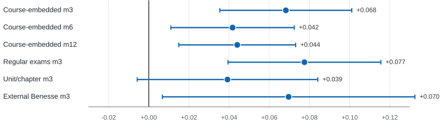

# Regular Same-Course eBook Activity, Not Click Volume Alone: Course-Aligned Trace Validity in K-12 Learning Analytics

## Abstract

Learning analytics dashboards often treat frequent clicks as evidence of engagement, yet a click only becomes interpretable when it is aligned with the instructional context in which learning is expected to occur. This paper proposes **course-aligned trace validity** as a design and analysis principle for ebook learning analytics: behavioral traces should be evaluated according to whether they are temporally prior to, and instructionally aligned with, the assessment outcome they are used to explain. We apply this principle to Bookroll ebook activity and course assessment records from a Japanese K-12 learning environment. The analysis uses 43,180 dated assessment records, direct course-context xAPI linkage, and 67.1 million same-course pre-assessment-month event-window observations in strong analysis cells. Models include student and assessment fixed effects, stricter student-course and assessment fixed effects, family-specific models, subject-specific models, window checks, strategy-adjusted models, and future-activity placebo checks. The strongest evidence appears in mathematics regular exams: same-course active eBook days in the three complete calendar months before the assessment month are positively associated with normalized scores (beta = +0.080, 95% CI [+0.039, +0.122]), while residual event intensity after adjustment is negative (beta = -0.084, 95% CI [-0.138, -0.030]). Across course-embedded assessments, active days remain positive across 3-, 6-, and 12-month windows. A shift from the first to the third quartile of active days corresponds to approximately +2.54 percentage points in normalized score. English regular exams show a positive but imprecise pattern, while course-linked external Benesse English assessments are treated as secondary, assessment-specific evidence. These results argue for a shift from click-count analytics to validity-aware indicators of regular, course-aligned eBook activity.

**Keywords:** learning analytics; ebook analytics; xAPI; trace validity; fixed effects; distributed study; Bookroll

## 1. Introduction

Digital learning environments record detailed traces of student activity. In ebook systems, students open materials, navigate pages, add markers, write memos, search, answer embedded questions, and return to content before assessments. These traces are attractive because they are large, timely, and apparently objective. Yet their interpretation is less straightforward than their volume suggests. A high event count may reflect sustained study, but it may also reflect searching, confusion, interface friction, repeated navigation, or task requirements. A low event count may indicate low engagement, but it may also indicate efficient review or offline study. The central problem is not whether trace data are abundant. The problem is whether they are validly aligned with the learning outcome being interpreted.

This paper addresses that problem through the idea of **course-aligned trace validity**. The central claim is that a behavioral trace should be interpreted as learning evidence only when the trace is connected to the same course context, occurs before the assessment, and represents a learning behavior that can plausibly support performance on that assessment. This requirement is often weakened in large-scale learning analytics when platform activity is summarized at broad student, tool, or calendar levels. Such summaries can produce strong predictive associations while mixing activity from different courses, assessments, and purposes. For educational decision making, that is not enough. If a teacher is to act on ebook analytics, the signal should describe the student's engagement with the materials relevant to that course and assessment.

The empirical setting is Bookroll, an ebook reader used within a Japanese K-12 learning environment connected to learning record infrastructure. Bookroll records xAPI statements for ebook interactions and includes course context fields that support direct linkage between ebook activity and Moodle course identifiers. Assessment records include course identifiers, course names, test names, test dates, and scores. This creates an opportunity to study whether sustained same-course ebook engagement in the complete calendar months before the assessment month is associated with assessment outcomes, while avoiding a broad and weak "platform use predicts achievement" claim.

The paper makes four contributions. Conceptually, it offers course-aligned trace validity as a practical criterion for transforming raw learning records into interpretable educational evidence. Methodologically, it demonstrates a data-construction and modeling approach that links same-course, pre-assessment-month ebook traces to assessment outcomes with fixed effects and placebo checks. Empirically, it shows that the most robust signal is not raw event volume, but the regularity of same-course active eBook days before the assessment month. For analytics design, it demonstrates why indicators should be subject- and assessment-aware: the clearest evidence appears in mathematics regular exams, English regular exams are positive but imprecise, and course-linked external Benesse English assessments reveal a secondary pattern that should be interpreted differently from teacher-made course exams.

The intended contribution is therefore not another predictive model using large educational logs. The stronger claim is methodological and educational: when trace data are correctly aligned to course context and assessment timing, regular same-course eBook activity becomes a more defensible indicator than click volume alone.

Conceptual framework. Course-aligned trace validity treats a trace as interpretable evidence only when course alignment, temporal precedence, behavioral interpretability, assessment fit, and aggregation validity are considered together.

In this study, the framework is operationalized as follows: course alignment is implemented by matching xAPI context_id to the Moodle course identifier; temporal precedence is implemented by using complete calendar months before the assessment month; behavioral interpretability is tested by comparing active days, event volume, and behavior-composition controls; assessment fit is examined by separating regular exams, unit/chapter tests, and external Benesse assessments; and aggregation validity is enforced by modeling at the student-course-test-date grain.

## 2. Related Work and Theoretical Framing

Learning analytics has long argued that digital traces can support feedback, prediction, and intervention at scale (Siemens & Long, 2011). At the same time, researchers have cautioned that traces are not direct measurements of cognition or learning. They are records of interactions with systems, and their meaning depends on task, context, design, and interpretation (Wise & Shaffer, 2015; Winne, 2020). This concern is especially important in ebook analytics, where action types such as page turns, markers, memos, and navigation can indicate different learning processes under different conditions (Ogata et al., 2015).

Prior work on learning design and analytics has emphasized that analytics should be interpreted in relation to the pedagogical intentions and assessment contexts of a learning activity (Gasevic et al., 2015; Lockyer et al., 2013). Course-aligned trace validity extends this idea to the level of data construction and empirical modeling. The question is not only whether a trace is predictive. The question is whether the trace is temporally and instructionally aligned with the outcome it is used to explain.

The focus on active days is motivated by research on distributed practice and self-regulated learning. Distributed study over time is a robust learning principle (Cepeda et al., 2006), and effective learning strategies often involve repeated retrieval, review, and monitoring rather than last-minute activity alone (Dunlosky et al., 2013). Ebook systems do not observe all study behavior, and active days should not be equated with high-quality study. However, active days are a conservative temporal indicator: they capture whether a student returned to same-course materials on multiple days before the assessment. Compared with raw event volume, active days are less sensitive to bursts of clicking and more directly connected to regularity.

The paper also draws on causal-cautious observational methods. Fixed effects do not create random assignment, but they can remove important stable confounds. Student fixed effects compare a student with themselves across assessment occasions, reducing confounding by stable ability, background, and general motivation. Assessment fixed effects compare students within the same assessment occasion, reducing confounding by shared test difficulty and course context. Student-course fixed effects go further by absorbing persistent differences in a student's performance or engagement within a specific course. These designs cannot remove all time-varying confounding, but they provide a stronger evidentiary basis than cross-sectional prediction (Angrist & Pischke, 2009; Shadish et al., 2002).

## 3. Research Questions

RQ1. Within students and assessment occasions, is same-course ebook activity in the complete calendar months before the assessment month associated with course assessment outcomes?

RQ2. Is the association better explained by raw event volume, behavior composition, or regularity of same-course active eBook days?

RQ3. How do the results differ by subject and assessment family?

RQ4. Do robustness and placebo checks support a temporal interpretation of pre-assessment-month active days?

## 4. Data and Measures

The analysis combines Bookroll xAPI statements with course assessment records. Bookroll is the ebook reader used for course materials in the learning environment. Students access course-linked digital texts through Bookroll, and interactions such as opening and closing content, page navigation, markers, memos, search, and embedded quiz actions are logged as xAPI statements. The xAPI records include course context fields: context_id is used as the Moodle course identifier, while context_title and context_label record course names. This direct course context allows ebook activity to be summarized at the same course grain as assessment outcomes.

The empirical setting includes junior-high and senior-high courses with Bookroll/xAPI trace availability through May 2026 at the time of analysis. The outcome-linked assessment records used for the present fixed-effect models have test conduct dates from April 2019 to March 2025, because no later dated assessment outcomes were present in the extracted course_student_scores analysis matrix. The clean dated assessment matrix contains 1,722 students, 216 courses, 900 assessment occasions, six grade levels (junior-high grades 1-3 and senior-high grades 1-3), and three detected course subjects (mathematics, English, and Japanese language). The modeled evidence focuses on mathematics and English because these subjects have sufficient course-linked ebook activity and assessment coverage in the strong-cell analysis. School identifiers are not reported in the manuscript; class information is treated as anonymized institutional context.

**Empirical context summary.**

| Item | Value |
| --- | --- |
| School level / grades | Junior high and senior high; grades 1-3 in each level |
| Bookroll/xAPI trace availability | Through May 2026 at analysis time |
| Outcome-linked assessment date range | 2019-04-10 to 2025-03-05 |
| Students in clean dated matrix | 1,722 |
| Courses in clean dated matrix | 216 |
| Assessment occasions | 900 |
| Subjects detected in score records | Mathematics, English, Japanese language |
| Rows with 3-month same-course Bookroll activity | 23,124 / 43,180 (53.6%) |
| Same-course pre-assessment-month Bookroll event-window observations in strong cells | 67.1 million |

The assessment data contain 67,672 score records. Rows without test dates were excluded because temporal ordering between activity and outcome could not be established. The analysis matrix contains 43,180 clean dated assessment records, of which 42,548 have valid normalized outcomes. The outcome is:

$$
\text{normalized score} = \frac{\text{quiz score} - \text{minimum score}}{\text{maximum score} - \text{minimum score}}.
$$

The analysis grain is one row per student, course, test name, and test date. Ebook features are computed only from same-course Bookroll activity before the assessment. The primary feature is log_active_days, defined as log(1 + the number of distinct active days with same-course ebook activity in the pre-assessment-month window). Raw event volume is represented by log_events, defined as log(1 + same-course event count). Event intensity is operationalized as log_events - log_active_days, capturing concentrated event volume conditional on active-day regularity. Additional behavior-composition controls include navigation, memo, marker, and content-session rates. These rates are shares of all same-course events in the window; the omitted remainder consists of other logged action types not represented by those controls. Zero-activity rows are retained with log features equal to zero and event-share features equal to zero.

The main pre-assessment-month window is defined at the calendar-month grain used by the xAPI feature table. The 3-month window includes the three complete calendar months immediately before the assessment month; the 6- and 12-month windows are defined analogously. For example, an assessment in January uses October through December activity for the 3-month window. The assessment month is excluded from the primary features to avoid same-day and within-month leakage when only month-level aggregate features are used. Thus, the primary models estimate sustained pre-assessment-month engagement rather than last-minute study in the days immediately before the test. This conservative choice may omit relevant study activity shortly before the test, but it protects temporal ordering. Future-placebo windows similarly exclude the assessment month and use months after the assessment month.

Strong analysis cells were defined before modeling using minimum sample and coverage rules: at least 100 valid outcomes, at least 100 students, at least 100 score rows with same-course xAPI activity in the 3-month window, and at least 50% same-course xAPI coverage. Coverage is the proportion of clean score rows in a grade-level by subject by assessment-family cell with at least one same-course Bookroll event in the 3-month pre-assessment-month window. This rule prevents large but weakly linked cells from dominating the evidence. Strong cells contain 27,409 valid score rows: 20,719 course-embedded assessment rows, 5,984 course-linked external Benesse rows, and 706 break-after-test diagnostic rows that are retained in diagnostics but not used for the main course-embedded or Benesse claims. The 67.1 million event count refers to assessment-window observations, so a raw xAPI statement may contribute to more than one later assessment window when windows overlap.

Data construction flow. The final fixed-effect samples are smaller than the strong-cell row count because fixed-effect models require within-student or within-student-course predictor variation and assessment occasions with sufficient observations.

Assessment families were classified into regular school exams, unit or chapter tests, and external Benesse assessments. Regular school exams and unit/chapter tests are treated as course-embedded assessments because they are more directly tied to the teacher's course sequence and course materials. Benesse assessments have course identifiers in the data and are therefore course-linked; however, they are externally designed and less directly tied to a single teacher-made course-material sequence. This distinction matters for interpretation.

The analysis uses de-identified institutional learning records made available to the research team under institutional data-governance procedures for secondary analysis. Student identifiers were replaced with anonymized IDs before analysis, student-level records remain in local analysis files, and the manuscript reports only aggregate counts, coefficients, confidence intervals, and derived diagnostics.

## 5. Analysis Design

The primary model uses student and assessment fixed effects:

$$
y_{iat} = \alpha_i + \gamma_a + \beta x_{iat} + \epsilon_{iat}.
$$

Here, \(y_{iat}\) is the normalized score for student \(i\) on assessment occasion \(a\), \(\alpha_i\) is a student fixed effect, and \(\gamma_a\) is an assessment-occasion fixed effect defined by course, test name, and test date. This design compares each student with themselves while controlling for assessment difficulty and shared course context.

The stricter robustness model replaces the student fixed effect with a student-course fixed effect:

$$
y_{icat} = \alpha_{ic} + \gamma_a + \beta x_{icat} + \epsilon_{icat}.
$$

This model asks whether deviations from a student's usual pattern within the same course are associated with deviations in assessment performance. It absorbs persistent student-course differences such as being consistently stronger in mathematics than English, or consistently more engaged in one course than another.

Models are estimated separately for assessment families and subject-specific subsets. Reported coefficients are standardized fixed-effect associations unless otherwise noted: after fixed-effect residualization, continuous outcomes and predictors are standardized within each model sample, so coefficients represent the expected standard-deviation change in normalized score associated with a one-standard-deviation change in the predictor. The effect-size table separately reports an unstandardized normalized-score interpretation. The mathematics regular-exam model is treated as the primary empirical test because it has the strongest course-embedded alignment and sample size; other subject-family models are interpreted as heterogeneity checks. Standard errors are clustered by student in the main tables. Because residuals may also be correlated within assessment occasions, a key sensitivity check re-estimated the mathematics regular-exam model with two-way student and assessment clustered standard errors. The active-days result was unchanged in interpretation (beta = +0.080, two-way SE = 0.021, p < .001), and the adjusted event-volume coefficient remained negative (beta = -0.084, two-way SE = 0.027, p = .002). The analysis is observational. The results are interpreted as causal-cautious evidence, not as proof that ebook activity caused achievement gains.

The analysis also includes robustness checks. First, active-days models are repeated across 3-, 6-, and 12-month pre-assessment-month windows. Second, an access/regularity check separates any same-course activity from the number of active days among rows with activity, using the same student-course and assessment fixed-effect structure; a parallel diagnostic re-expresses event volume as event intensity. Third, temporal strategy categories are compared before and after adding behavior features. Fourth, future-activity placebo models test whether activity after an assessment predicts the earlier score in the same positive direction. The primary model is also re-estimated with stricter active-day definitions and with a within-assessment z-score outcome. A positive future-placebo effect would weaken the temporal interpretation.

## 6. Results

### 6.1 Main Finding: In Mathematics Regular Exams, Regularity Beats Click Volume

The most important result is subject-specific. In mathematics regular exams, same-course active eBook days remain positive in the strict student-course fixed-effect model, while adjusted residual event intensity is negative. The adjusted 3-month student-course fixed-effect estimate for active days is +0.080 (95% CI [+0.039, +0.122], p < .001, 10,968 rows). In the same model, the adjusted log-event coefficient is -0.084 (95% CI [-0.138, -0.030]).

This does not mean that clicking is harmful. It means that, after controlling for a student's stable course-specific differences, assessment occasion, active days, and behavior composition, extra event intensity is not the educationally meaningful signal. A reparameterized model separating regularity from event intensity gave the same interpretation: active days remained positive (beta = +0.049, 95% CI [+0.018, +0.081]) and event intensity remained negative (beta = -0.062, 95% CI [-0.102, -0.022]).

To check whether active days merely reflect any access rather than regularity, we split the primary predictor into any same-course activity and log active days among active rows. In the same model, the any-activity coefficient was -0.085 (95% CI [-0.154, -0.017]), while the active-days component remained positive (beta = +0.044, 95% CI [+0.013, +0.075]). The negative any-activity coefficient should not be interpreted as evidence that access itself is harmful; in this specification, it represents minimal or occasional access after separating out regular active-day engagement, behavior composition, student-course differences, and assessment effects. The active-days result also remained positive under stricter daily definitions requiring at least two events, at least three events, or at least one non-open/close event (betas +0.077 to +0.085).

Figure 1. Subject-specific trace-validity evidence from adjusted 3-month models with student-course and assessment fixed effects. Mathematics regular exams show the clearest contrast: active days are positive, while adjusted residual event intensity is negative. Other assessment types provide supportive or exploratory evidence rather than equally strong confirmation.

Table 1 summarizes the subject-specific active-days estimates. Mathematics regular exams are the strongest empirical anchor. Mathematics course-embedded assessments are also robust. Unit/chapter tests are positive but less precise in the strict model. English regular exams have a positive coefficient, but the confidence interval crosses zero. English external Benesse assessments show a notable positive strict-model coefficient, which is treated as a secondary finding because the assessment is course-linked but externally designed.

**Table 1. Subject-specific active-days estimates in adjusted 3-month models.**

| Scope | Subject | Student FE beta | Student FE 95% CI | Student FE p | Rows | Student-course FE beta | Student-course FE 95% CI | Student-course FE p | Rows |
| --- | --- | ---: | --- | ---: | ---: | ---: | --- | ---: | ---: |
| Course-embedded | Mathematics | +0.089 | [+0.052, +0.127] | <.001 | 15,630 | +0.070 | [+0.035, +0.105] | <.001 | 14,975 |
| Course-embedded | English | +0.069 | [-0.022, +0.160] | .135 | 3,050 | +0.064 | [-0.022, +0.150] | .147 | 2,738 |
| Regular exams | Mathematics | +0.098 | [+0.054, +0.141] | <.001 | 11,625 | +0.080 | [+0.039, +0.122] | <.001 | 10,968 |
| Regular exams | English | +0.069 | [-0.022, +0.160] | .135 | 3,050 | +0.064 | [-0.022, +0.150] | .147 | 2,738 |
| Unit/chapter tests | Mathematics | +0.058 | [+0.010, +0.105] | .017 | 4,002 | +0.039 | [-0.006, +0.084] | .088 | 4,002 |
| External Benesse | Mathematics | +0.033 | [-0.031, +0.096] | .316 | 3,484 | +0.027 | [-0.053, +0.107] | .506 | 3,050 |
| External Benesse | English | +0.090 | [-0.005, +0.184] | .062 | 2,189 | +0.140 | [+0.033, +0.247] | .011 | 1,670 |

Note. Student FE and student-course FE columns use the same adjusted behavior specification, but the retained rows differ because the fixed-effect requirement differs. The 10,968 rows reported in the text are the mathematics regular-exam rows retained by the strict student-course FE model; the 11,625 rows in the same table are retained by the student FE model.

### 6.2 Course-Embedded Active Days Are Robust Across Windows

Across course-embedded assessments, active days remain positive across 3-, 6-, and 12-month windows in the strict student-course fixed-effect model. The 3-month estimate is +0.068 (95% CI [+0.035, +0.101]), the 6-month estimate is +0.042 (95% CI [+0.011, +0.072]), and the 12-month estimate is +0.044 (95% CI [+0.015, +0.073]). Regular exams show the strongest 3-month result (+0.077, 95% CI [+0.039, +0.116]). Unit/chapter tests are positive but less precise (+0.039, 95% CI [-0.006, +0.084]).

Figure 2. Window robustness of active-days effects in the same strict student-course fixed-effect family as Table 2. The visual and table use the same model family to keep coefficient magnitudes directly comparable.

**Table 2. Student-course fixed-effect robustness for active days.**

| Scope | Window | Student FE beta | Student-course FE beta | Student-course 95% CI | p | Rows | Student-courses |
| --- | --- | ---: | ---: | --- | ---: | ---: | ---: |
| Course-embedded | m3 | +0.059 | +0.068 | [+0.035, +0.101] | <.001 | 17,713 | 2,089 |
| Course-embedded | m6 | +0.042 | +0.042 | [+0.011, +0.072] | .008 | 17,709 | 2,089 |
| Course-embedded | m12 | +0.042 | +0.044 | [+0.015, +0.073] | .003 | 17,543 | 2,067 |
| Regular exams | m3 | +0.067 | +0.077 | [+0.039, +0.116] | <.001 | 13,706 | 2,088 |
| Unit/chapter tests | m3 | +0.058 | +0.039 | [-0.006, +0.084] | .088 | 4,002 | 707 |
| External Benesse | m3 | +0.036 | +0.070 | [+0.007, +0.133] | .030 | 4,720 | 2,360 |

The external Benesse estimate is also positive in this model. This is important because it prevents an over-simple interpretation. The data do not say that external assessments are unrelated to Bookroll activity. They say that the most directly interpretable and strongest course-aligned evidence is in course-embedded mathematics regular exams, while external assessments require a different explanation.

### 6.3 The Magnitude Is Educationally Meaningful but Not Inflated

The student-course fixed-effect coefficient for log(1 + active days) is 0.0176 normalized-score points in the effect-size interpretation model. Among active rows, the first quartile, median, and third quartile of active days are 7, 21, and 33 days. Moving from the first to the third quartile corresponds to an estimated +2.54 percentage-point difference in normalized score. Moving from 3 to 10 active days corresponds to approximately +1.78 percentage points.

This magnitude is modest but educationally interpretable. Its value is that it survives a demanding observational design and is attached to a behavior that teachers can understand: students who return to relevant course materials across more days before assessment tend to do better than the same students do when they show less regular same-course activity.

**Table 3. Interpreting the active-days effect size.**

| Quantity | Value |
| --- | --- |
| Student-course FE beta for log(1 + active days) | 0.0176 normalized-score points |
| Clustered SE | 0.0043 |
| Active days among active rows, Q1 / median / Q3 | 7 / 21 / 33 days |
| Predicted difference from Q1 to Q3 active days | 2.54 percentage points |
| Predicted difference from 3 to 10 active days | 1.78 percentage points |
| Excluding top 1% event-volume rows | beta = 0.0197, SE = 0.0044 |
| Coverage threshold sensitivity, 40%-90% | beta remained approximately 0.0175 |
| Residual correlation: log events vs log active days | 0.777 |

The sensitivity checks support the stability of the estimate. Excluding the top 1% of event-volume rows slightly increases the estimate rather than removing it. Changing the coverage threshold from 40% to 90% leaves the coefficient essentially unchanged. The high residual correlation between event volume and active days motivates the intensity diagnostic above: once regularity is modeled, remaining event volume is better interpreted as concentrated event intensity than as simple engagement volume.

### 6.4 Strategy Labels Shrink After Behavior Adjustment

Temporal strategy categories provide useful descriptive labels, but they are not the main mechanism. Distributed navigation and distributed sustained activity are positive when entered alone, but after adding behavior features the coefficients shrink and the confidence intervals cross zero. The practical implication is that dashboards should foreground concrete regularity indicators rather than opaque strategy labels.

**Table 4. Strategy contrasts before and after behavior adjustment.**

| Temporal strategy | Total beta | Total 95% CI | Adjusted beta | Adjusted 95% CI |
| --- | ---: | --- | ---: | --- |
| Distributed navigation | +0.034 | [+0.006, +0.061] | +0.012 | [-0.064, +0.087] |
| Distributed sustained | +0.036 | [+0.009, +0.063] | +0.010 | [-0.064, +0.083] |
| Late intensive | +0.018 | [-0.003, +0.039] | +0.011 | [-0.061, +0.083] |
| Intermittent activity | +0.024 | [-0.006, +0.054] | +0.002 | [-0.096, +0.100] |
| Early declining | +0.006 | [-0.015, +0.027] | +0.000 | [-0.061, +0.062] |
| Single-month activity | +0.012 | [-0.004, +0.027] | +0.015 | [-0.026, +0.056] |

For practical analytics, the table supports using strategy labels mainly as summaries of measurable activity patterns, not as independent explanations.

### 6.5 Placebo Checks Support Caution, Not Overclaiming

The future-activity placebo asks whether activity after an assessment predicts the earlier score. For unit/chapter tests, pre-assessment-month active days are positive (+0.077, 95% CI [+0.033, +0.120]) while future active days are negative (-0.061, 95% CI [-0.115, -0.007]). For regular exams, the placebo model does not reproduce a positive future effect, but its pre-window estimate is also imprecise (+0.015, 95% CI [-0.020, +0.049]) because the future-window specification changes the identified within-student sample and variation. Thus, placebo checks support temporal interpretation for unit/chapter tests and do not contradict the regular-exam findings, but they do not independently prove the mathematics regular-exam mechanism.

This is why the paper uses causal-cautious language. The fixed-effect and placebo results reduce several alternative explanations, but they cannot eliminate time-varying factors such as exam-specific motivation, teacher support, classroom pacing, private tutoring, or offline study.

## 7. Discussion

### 7.1 The Main Contribution: Trace Validity Before Trace Volume

The headline result is not simply that ebook use predicts scores. That would be too broad and too easy to overstate. The stronger contribution is that trace validity changes what counts as meaningful engagement. When activity is aligned to the same course, restricted to the pre-assessment-month period, and modeled with student-course and assessment fixed effects, regular same-course active eBook days carry the clearest educational signal. Event volume alone is less interpretable, and its adjusted coefficient should be understood as concentrated event intensity after regularity has already been accounted for.

This matters for learning analytics because many dashboards still make volume visually salient: total events, total time, total pages, total accesses. Such measures are easy to compute but difficult to interpret. The present results suggest that a validity-aware dashboard should ask a different question: did the student return to the relevant course materials across multiple days before the relevant assessment?

### 7.2 Why Mathematics Regular Exams Are the Strongest Claim

Mathematics regular exams provide the clearest empirical case for three reasons. First, the same-course linkage is strong and the sample is large. Second, regular exams are closely tied to the course sequence and materials, making Bookroll activity instructionally relevant. Third, mathematics learning often requires repeated problem exposure, review, and procedural consolidation, which makes distributed same-course activity a plausible mechanism.

This does not mean the finding is mathematics-only in a trivial sense. English regular exams also show positive coefficients, but the estimates are less precise. The appropriate interpretation is that the current evidence supports a strong claim for mathematics regular exams and a weaker, exploratory claim for English regular exams. This is a strength rather than a weakness of the paper: it shows that course-aligned trace validity is not a slogan applied uniformly to all data. It is an empirical standard that can reveal where a trace is strong, where it is weak, and where a different theory is needed.

### 7.3 How to Interpret the Benesse English Finding

The Benesse English result is important but should not become the main storyline. These records include course identifiers, so they are not disconnected from courses. However, Benesse assessments are externally designed and less directly tied to a teacher's immediate course-material sequence than regular exams. The positive strict-model estimate for English Benesse may indicate that English ebook activity reflects broader preparation, vocabulary exposure, reading practice, or general course engagement that transfers to external assessment performance. It may also reflect unobserved preparation patterns that are not captured by the current model.

This result expands the research agenda by showing that course-aligned traces may operate differently depending on whether assessments are course-embedded or externally designed.

### 7.4 Implications for Learning Analytics Design

The findings suggest four design implications.

First, course context should be treated as a first-class feature in learning analytics infrastructure. Without course identifiers, ebook traces risk being aggregated across unrelated learning purposes.

Second, dashboards should make regularity visible. A student with moderate same-course eBook activity across many days may be showing a stronger learning pattern than a student with a single intense burst of clicks.

Third, click volume should be handled carefully. It can be useful descriptively, but after regularity and context are modeled, volume alone is not a stable indicator of productive engagement.

Fourth, analytics should be subject- and assessment-aware. The same trace feature can have different evidentiary strength for mathematics regular exams, English regular exams, unit tests, and external assessments. Validity-aware systems should communicate this uncertainty rather than flattening all results into one engagement score.

## 8. Limitations

The study is observational. Fixed effects and placebo checks improve the design but cannot establish random assignment. Time-varying motivation, teacher support, homework, tutoring, classroom pacing, and offline study may still confound the association between ebook activity and scores.

The outcome is a normalized assessment score, not a vertically scaled measure of learning growth. Assessment fixed effects reduce differences in test difficulty, but normalized scores do not make all tests psychometrically equivalent. As a robustness check for the primary mathematics regular-exam model, replacing normalized score with a within-assessment z-score outcome left the active-days result essentially unchanged (beta = +0.079, 95% CI [+0.038, +0.119]).

Bookroll traces capture ebook activity only. They do not observe paper study, classroom discussion, peer learning, private tutoring, or use of other digital tools. Active days should therefore be interpreted as regular same-course ebook engagement, not total study time.

The English regular-exam evidence is positive but imprecise, and the English Benesse finding needs targeted follow-up. Future work should examine the content of English ebook materials, the construct measured by each external assessment, and whether different ebook actions have subject-specific meaning.

Although the mathematics regular-exam result was robust to stricter active-day definitions, future work should further examine the qualitative content of these active days, including whether students engaged in problem solving, review, retrieval practice, or superficial navigation.

Finally, the analysis uses strong-cell rules to protect validity. This improves claim quality but means the results should be generalized to weaker-coverage settings only with caution. The strong-cell design is not intended to estimate platform-wide average effects; it estimates relationships only where course-linked trace evidence is sufficiently observable.

## 9. Conclusion

This paper argues that learning analytics needs trace validity before trace volume. In a large K-12 Bookroll dataset with direct course-context linkage, the most defensible indicator of assessment performance is not how many ebook events students generated, but whether they returned to same-course materials across multiple days in the complete calendar months before the assessment month. The strongest evidence appears in mathematics regular exams: same-course active eBook days remain positive under student-course and assessment fixed effects, while adjusted residual event intensity is negative. The result is educationally meaningful, modest in size, and robust enough to guide analytics design.

The broader contribution is a principle for cumulative learning analytics research: traces should be evaluated by their alignment with course context, assessment timing, and instructional purpose. When that alignment is taken seriously, analytics can move beyond counting clicks toward evidence that teachers and learners can actually use.

## References

Angrist, J. D., & Pischke, J.-S. (2009). *Mostly harmless econometrics: An empiricist's companion*. Princeton University Press.

Cepeda, N. J., Pashler, H., Vul, E., Wixted, J. T., & Rohrer, D. (2006). Distributed practice in verbal recall tasks: A review and quantitative synthesis. *Psychological Bulletin, 132*(3), 354-380.

Dunlosky, J., Rawson, K. A., Marsh, E. J., Nathan, M. J., & Willingham, D. T. (2013). Improving students' learning with effective learning techniques: Promising directions from cognitive and educational psychology. *Psychological Science in the Public Interest, 14*(1), 4-58.

Gasevic, D., Dawson, S., Rogers, T., & Gasevic, D. (2015). Learning analytics should not promote one size fits all: The effects of instructional conditions in predicting academic success. *The Internet and Higher Education, 28*, 68-84.

Lockyer, L., Heathcote, E., & Dawson, S. (2013). Informing pedagogical action: Aligning learning analytics with learning design. *American Behavioral Scientist, 57*(10), 1439-1459.

Ogata, H., Oi, M., Mohri, K., Okubo, F., Shimada, A., Yamada, M., Wang, J., & Hirokawa, S. (2015). Learning analytics for e-book-based educational big data in higher education. In *Smart sensors at the IoT frontier* (pp. 327-350). Springer.

Ogata, H., et al. (2022). Learning and Evidence Analytics Framework (LEAF): Supporting data-informed educational improvement. *Educational Technology Research and Development*.

Ogata, H., et al. (2024). Evidence-centered learning analytics infrastructure for educational practice. *Research and Practice in Technology Enhanced Learning*.

Shadish, W. R., Cook, T. D., & Campbell, D. T. (2002). *Experimental and quasi-experimental designs for generalized causal inference*. Houghton Mifflin.

Siemens, G., & Long, P. (2011). Penetrating the fog: Analytics in learning and education. *EDUCAUSE Review, 46*(5), 30-32.

Winne, P. H. (2020). Construct and consequential validity for learning analytics based on trace data. *Computers in Human Behavior, 112*, 106457.

Wise, A. F., & Shaffer, D. W. (2015). Why theory matters more than ever in the age of big data. *Journal of Learning Analytics, 2*(2), 5-13.
