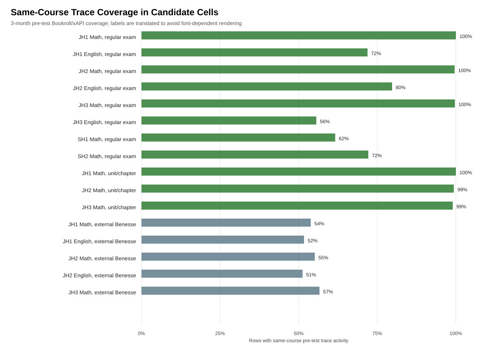
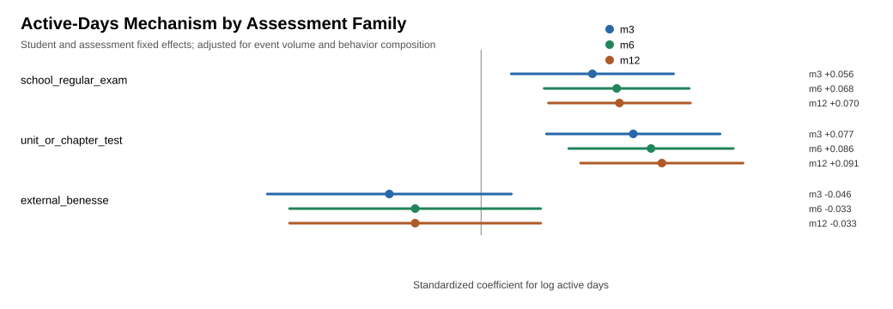
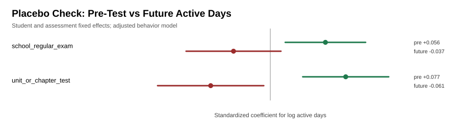

# Regular Study Days, Not Click Volume Alone: Temporally Ordered Evidence from Bookroll Traces and Course-Aligned Outcomes

## Abstract

Fine-grained ebook logs are often interpreted as indicators of engagement, but high event volume alone is a weak basis for learning analytics claims. This study asks whether temporally organized same-course ebook activity predicts later assessment performance in K-12 courses, and whether such associations survive stricter observational controls. We linked Bookroll/xAPI traces with grade/test records and Learning Management System (LMS) course metadata, mapping events to a common student-course-month feature layer. After reimporting the old xAPI table, old and new Bookroll events both carry direct course context through xAPI `context_id`, allowing same-course linkage without the earlier Bookroll relational event-log or content-directory bridge. Models used normalized assessment scores, student fixed effects, and assessment-occasion fixed effects, comparing each student against their own other assessments while controlling for course/test/date difficulty. A stricter robustness model added student-course fixed effects to remove stable student-by-course differences.

Across course-embedded regular exams and unit/chapter tests, active study days before the assessment were associated with higher outcomes after adjusting for raw event volume and behavior composition. In the two-way fixed-effect models, active days remained positive across 3-, 6-, and 12-month windows, while raw event volume was weaker and less stable after accounting for regularity. The association also remained positive in student-course fixed-effect models for the combined course-embedded sample. Temporal strategy models showed that category-level strategy advantages were largely explained by measured behavior features, especially active days. A future-activity placebo check supported temporal interpretation for unit/chapter tests and did not show a positive future-activity pattern for regular exams. The results support the interpretation that regular same-course ebook engagement is a stronger and more interpretable signal than click volume alone.

## 1. Introduction

Digital textbooks and ebook readers can record detailed traces of learners' interactions with course materials. These traces are attractive for learning analytics because they are collected during ordinary study rather than in artificial laboratory tasks. However, trace data also create a familiar risk: many learning analytics systems may be optimizing the wrong signal. A student who generates many clicks is not necessarily studying effectively, and an aggregate engagement count may mix navigation, repeated opening, annotation, review, and post-assessment remediation.

This paper takes a narrower and more defensible approach. Instead of asking whether students who generally use ebooks more perform better, we ask whether same-course ebook activity before course-aligned assessments is associated with better outcomes within students and within assessment occasions. This distinction matters. Between-student comparisons are vulnerable to stable confounding: higher-achieving or more motivated students may both study more and score higher. Assessment-level comparisons are also confounded because some tests are harder, some courses are structured differently, and some subject-grade combinations use ebooks more heavily. We therefore use student fixed effects and assessment-occasion fixed effects to ask whether a student's own variation in pre-test ebook regularity aligns with their own variation in outcomes across assessments.

The empirical setting is a K-12 ebook learning environment in Japan. The data include grade/test outcomes, Learning Management System (LMS) course metadata, and Bookroll/xAPI traces. A methodological contribution is the construction of a same-course longitudinal trace layer that links ebook activity to the specific course and assessment context in which learning outcomes are observed. Event records are summarized at a student-course-month grain and joined to cleaned score outcomes only after validating course linkage and temporal ordering.

The analysis leads to a clearer but more nuanced result after the direct-context rerun. The most stable predictor is the number of active same-course study days before course-embedded assessments. Raw event volume can carry signal in broader assessment-fixed-effect models, but it becomes weak in the stricter two-way fixed-effect models once active days and behavior composition are included. Regular same-course ebook activity therefore appears to be the more defensible learning-analytics signal, while event volume should be interpreted as a supporting usage measure rather than the primary mechanism.

The paper makes three contributions. First, it provides a same-course trace construction approach that links ebook behavior to the specific course and assessment context in which outcomes are observed using direct xAPI course context. Second, it demonstrates that regularity of same-course study days is more robust and interpretable than raw click volume alone for course-aligned outcomes. Third, it uses a causal-cautious observational design with student fixed effects, stricter student-course fixed effects, assessment fixed effects, assessment-family contrasts, and a future-activity placebo check. Together, these steps move the analysis beyond descriptive trace mining toward a broader validity principle: trace data become more meaningful when they are course-aligned, temporally ordered, and interpreted against the assessment context they are meant to inform.

### 1.1 Related Work and Positioning

Learning analytics research has long relied on behavioral traces from digital learning environments, yet the validity of such traces remains a central challenge (Siemens & Long, 2011; Winne, 2020; Wise & Shaffer, 2015). Log data are precise records of interaction, but they are not automatically precise records of learning. Page turns, clicks, dwell time, highlights, and annotations can reflect purposeful study, confusion, interface friction, repeated opening, or post-assessment review. This ambiguity is especially important in ebook environments, where learners may interact with the same material in many ways and for many reasons. The present study addresses this validity problem by asking whether ebook behavior remains predictive after three restrictions are imposed: events must be linked to the same course as the assessment, behavior must occur before the assessment, and estimates must compare students within the same assessment context.

Research on self-regulated learning and distributed practice provides a theoretical basis for focusing on regularity rather than volume (Cepeda et al., 2006; Dunlosky et al., 2013). Distributed engagement across multiple study occasions is more consistent with sustained preparation than a large number of actions concentrated in a short period. The active-days measure used here is not a direct psychological measure of self-regulation, motivation, or metacognition. It is a behavioral indicator of repeated same-course study occasions. This distinction is important: the paper does not claim to infer students' internal states from logs. Instead, it tests whether an observable temporal pattern of engagement is associated with course-aligned achievement.

Digital textbook and ebook analytics studies often examine page views, navigation, bookmarks, highlights, memos, and other interaction types as indicators of engagement or strategy (Ogata et al., 2015). A limitation of this approach is that individual action types can be difficult to interpret in isolation. More annotations may indicate deeper processing, but they may also indicate confusion, copying, or task requirements. More navigation may indicate purposeful review, but it may also indicate searching or disorientation. The contribution of the present analysis is therefore not another ranking of raw action types. It shows that annotation-heavy and click-heavy behavior are not sufficient explanations once regularity and assessment context are considered. Regular same-course active study days provide a more stable signal than raw event volume.

Methodologically, this study contributes a causal-cautious observational design for ebook trace analysis. Student fixed effects reduce confounding from stable learner characteristics such as prior achievement, general motivation, and background. Assessment-occasion fixed effects control for course, test name, test date, and shared assessment difficulty. Student-course fixed effects add a stricter robustness check by absorbing persistent learner-course differences. Family-specific models distinguish course-embedded assessments from external standardized tests, and a future-activity placebo checks whether activity after the assessment reproduces the pre-assessment association. These choices connect the learning analytics concern with trace validity to the learning-design concern with alignment: behavioral traces should be interpreted only in relation to the instructional context and assessment purpose they plausibly represent (Gašević et al., 2015; Lockyer et al., 2013). They do not turn observational data into experimental evidence, but they substantially raise the evidentiary standard beyond cross-sectional prediction or descriptive dashboard analytics (Angrist & Pischke, 2009; Shadish et al., 2002).

## 2. Research Questions

RQ1. Within students and assessment occasions, is pre-test same-course ebook activity associated with course assessment outcomes?

RQ2. Is the association better explained by raw event volume, behavior composition, or regularity of active study days?

RQ3. Does the active-days mechanism generalize across assessment families, or is it specific to course-embedded assessments?

RQ4. Does a future-activity placebo check weaken or strengthen the temporal interpretation?

## 3. Data and Linkage

The source data combine three kinds of records: assessment outcomes, LMS course metadata used to recover grade/subject context, and Bookroll/xAPI event traces. Rows with missing test conduct dates were excluded from test-window analysis because the temporal ordering of behavior and outcome could not be established. The source scaled score field was not used because it was zero in dated score rows. The primary outcome is therefore a normalized score:

$$
\text{normalized score} = \frac{\text{quiz} - \text{minimum score}}{\text{maximum score} - \text{minimum score}}.
$$

The learning environment is part of LEAF, the Learning and Evidence Analytics Framework, which connects learning tools and learning record infrastructure to support data-informed educational practice in Japanese settings (Ogata et al., 2022, 2024). Within this environment, Bookroll is the ebook reader used for course materials. Students access assigned digital texts through Bookroll, and interactions such as opening and closing content, page navigation, markers, memos, search, and embedded quiz actions are logged as xAPI statements. This makes Bookroll traces suitable for studying when and how students return to same-course materials before assessments, while LEAF provides the broader infrastructure for connecting those traces to course context and outcomes.

The ebook trace layer required careful preprocessing because logs were collected over multiple school years and courses. The pipeline summarizes trace records at a common feature grain: student by course by event month. After the old xAPI table was reimported, Bookroll records in both `saikyo_old.statements_mv` and `saikyo_new.statements_mv` carry direct course context: `context_id` is interpreted as the Moodle course ID, while `context_title` and `context_label` record course names. A bounded audit of old Bookroll content events from 2019-01-01 through before 2025-04-01 found 46,633,944 of 46,701,509 rows with `context_id` populated (99.86%). The analysis therefore uses ClickHouse xAPI directly for Bookroll behavior linkage; the earlier Bookroll relational event-log/content-directory bridge is not part of the main analysis path.

This direct-context rerun changes the manuscript evidence base. The previous 59,209,738 old-event exclusion was caused by the old content-course bridge and should no longer be treated as a current limitation. In the updated same-course matrix, 45,681,730 old events and 4,095,770 new events are represented in same-course context_id features for score students. For the current dated score outcomes, the modeled 3-month pre-test evidence still comes from old-source rows because the latest dated outcomes are before the new xAPI period contributes materially.

Table 1 summarizes the sample construction. A strong grade/subject/test-family cell is defined before fixed-effect modeling as one with at least 100 valid outcomes, at least 100 students, at least 100 score rows with same-course xAPI activity in the 3-month pre-test window, and at least 50% 3-month same-course xAPI coverage, where coverage is calculated over all clean score rows in the cell. This rule prevents large but weakly linked cells from being treated as strong evidence.

| Stage | Records | Role in analysis |
| --- | --- | --- |
| Raw score records | 67,672 | Initial assessment-score table |
| Clean dated assessment records | 43,180 | Rows with test date available for temporal ordering |
| Valid normalized outcomes | 42,548 | Rows with usable normalized score |
| Strong-cell valid rows | 27,409 | Rows in cells meeting the strong-cell rule |
| Course-embedded rows | 20,719 | Regular exams and unit/chapter tests |
| External Benesse contrast rows | 5,984 | External assessment comparison |
| Break-after-test rows | 706 | Retained in diagnostics but not the main course-embedded claim |
| Global fixed-effect rows | 26,940 | Strong-cell rows after student and assessment FE filtering |
| Course-embedded student+assessment FE rows | 18,815 | Main course-aligned fixed-effect comparison |
| Course-embedded student-course+assessment FE rows | 17,713 | Stricter robustness comparison |
| Same-course pre-test ebook events in strong cells | 67,095,840 | Trace richness in the 3-month pre-test window |

Figure 1. Same-course pre-test xAPI coverage in candidate analysis cells. The direct-context rerun expands high-coverage cells beyond the earlier junior-high mathematics-only evidence base.

For the main models, we focus on strong course-embedded cells: regular school exams and unit/chapter tests. External Benesse tests are analyzed separately as a theoretically important contrast because they are more formal and less directly tied to a single course's ebook materials.

### 3.1 Ethics and Data Governance

The analysis uses de-identified institutional learning records for secondary analysis. Student-level records remain in local analysis files and are not exported in the manuscript, figures, tables, or agent-facing summaries. The paper reports only aggregate counts, coefficients, confidence intervals, and derived diagnostics. Any submission version should state the applicable institutional approval, administrative permission, or consent basis for the dataset. The analysis pipeline was designed to minimize exposure of K-12 student data: raw and row-level files remain local, and course linkage is based on direct xAPI course context rather than manual inference from relational logs.

## 4. Measures

The outcome is normalized assessment score. The main behavior feature is log_active_days, defined as log(1 + active days), where active days is the count of distinct days with same-course ebook activity in the pre-test window. Other behavior features include log event volume, defined as log(1 + events), and navigation, memo, marker, and content-session shares, each divided by max(events, 1). Zero-activity rows are retained: log features equal 0 and event-share features equal 0. These features are computed for 3-, 6-, and 12-month windows before the assessment. For temporal strategy analysis, the 3-month pre-test period is divided into early, middle, and late phases.

Time-spent features were considered but not used as the primary mechanism in the primary analysis. The logs include elapsed time since the previous activity, but such values can overstate study time when a learner leaves a page open, switches tasks, or resumes after an idle period. Without a carefully validated timeout rule, time spent risks adding a noisier proxy than active days. For this paper, active days provide a more conservative temporal measure. Time-spent variants should be reported as a robustness analysis after defining and validating session-time caps.

Temporal strategy categories include distributed navigation, distributed sustained activity, late-intensive activity, early-declining activity, intermittent activity, single-month activity, and no same-course activity. These categories are descriptive and are not treated as causal mechanisms by themselves. The stricter model includes both strategy categories and behavior features to test whether strategy labels retain explanatory value after measured behavior regularity and composition are included.

## 5. Analysis Design

The analysis is observational and causal-cautious. We do not claim random assignment to ebook behavior. The strongest models use two-way fixed effects:

$$
y_{iat} = \alpha_i + \gamma_a + \beta x_{iat} + \epsilon_{iat}.
$$

where y_iat is the normalized score for student i on assessment occasion a, alpha_i is a student fixed effect, and gamma_a is an assessment-occasion fixed effect defined by course, test name, and test date. This design compares a student with themselves across assessment occasions while controlling for difficulty and context shared by students taking the same assessment.

The design reduces confounding from stable student ability, stable motivation, background, and fixed differences across assessments. It does not remove time-varying confounding such as changes in effort, teacher support, offline study, or exam-specific preparation. For this reason, the paper uses terms such as associated with, consistent with, and supports a causal-cautious interpretation.

Assessment occasions with fewer than 20 rows are removed before fixed-effect estimation. Student fixed-effect models require at least two rows per student and within-student variation in at least one predictor. Student-course models apply the same logic at the student-course level. Reported coefficients are standardized residual associations unless explicitly labeled as unstandardized. Confidence intervals for the global window model use student-cluster bootstrap resampling; family-specific, student-course, and placebo models use student-clustered standard errors. Standard errors are clustered by student because repeated observations are nested within learners across courses and assessment occasions.

We add four robustness checks. First, we repeat models across 3-, 6-, and 12-month windows. Second, we estimate family-specific models for regular school exams, unit/chapter tests, and Benesse tests. Third, we estimate stricter models with student-course fixed effects:

$$
y_{icat} = \alpha_{ic} + \gamma_a + \beta x_{icat} + \epsilon_{icat}.
$$

where alpha_ic absorbs stable differences for student i in course c. This check asks whether the result remains after controlling for a student's persistent course-specific strength, weakness, or engagement level. Fourth, we use a future-activity placebo: if activity after an assessment predicts the previous score in the same positive direction, the temporal interpretation is weaker.

## 6. Results

### 6.1 Regularity Is More Stable Than Raw Event Volume

The direct-context rerun shows that active days remain the most stable behavior feature. In the broader assessment-fixed-effect model, both active days and raw event volume can be positive, reflecting the much larger recovered same-course event base. In the stricter two-way fixed-effect model with student and assessment fixed effects, however, raw event volume becomes weak across windows, while active days remains positive: +0.060 in the 3-month window, +0.048 in the 6-month window, and +0.042 in the 12-month window. This supports a more careful claim: click volume is not meaningless, but regular same-course study days are the more robust and interpretable signal once stable student differences are removed.

Figure 2. Window robustness of behavior effects. Active days remain positive across pre-test windows in the two-way fixed-effect model, whereas raw event volume is weaker after adjustment for regularity and behavior composition.

### 6.2 Temporal Strategy Effects Are Largely Explained by Measured Regularity

Distributed strategy categories are positive relative to no same-course activity when entered alone, especially distributed navigation and distributed sustained activity. When behavior features are added, strategy coefficients shrink and confidence intervals cross zero. Active days remains positive in the adjusted model. This means that the apparent advantage of named strategies is largely explained by measured regularity of engagement rather than by the strategy labels themselves.

Table 2. Strategy contrasts before and after behavior adjustment.

| Temporal strategy | Total beta | Total 95% CI | Adjusted beta | Adjusted 95% CI |
| --- | --- | --- | --- | --- |
| distributed_navigation | +0.034 | [+0.006, +0.061] | +0.012 | [-0.064, +0.087] |
| distributed_sustained | +0.036 | [+0.009, +0.063] | +0.010 | [-0.064, +0.083] |
| late_intensive | +0.018 | [-0.003, +0.039] | +0.011 | [-0.061, +0.083] |
| intermittent_activity | +0.024 | [-0.006, +0.054] | +0.002 | [-0.096, +0.100] |
| early_declining | +0.006 | [-0.015, +0.027] | +0.000 | [-0.061, +0.062] |
| single_month_activity | +0.012 | [-0.004, +0.027] | +0.015 | [-0.026, +0.056] |

### 6.3 Active Days Are Clearest for Course-Embedded Assessments

The family-specific student fixed-effect models show the clearest active-days signal for course-embedded assessments. Regular school exams are positive across all windows. Unit/chapter tests are positive in the 3-month window and remain positive but less precise in longer windows. External Benesse tests are positive in sign but not statistically clear in the student fixed-effect family-specific model, so they should be treated as a contrast with weaker evidence rather than as a clean null.

Table 3. Active-days effects by assessment family.

| Assessment family    | Window | Active-days beta | 95% CI           | p     | Rows  | Students | Assessments |
| -------------------- | ------ | ---------------- | ---------------- | ----- | ----- | -------- | ----------- |
| school_regular_exam | m3 | +0.067 | [+0.029, +0.105] | 0.001 | 14,810 | 856 | 399 |
| school_regular_exam | m6 | +0.045 | [+0.005, +0.086] | 0.027 | 14,809 | 856 | 399 |
| school_regular_exam | m12 | +0.045 | [+0.004, +0.085] | 0.029 | 14,790 | 853 | 399 |
| unit_or_chapter_test | m3 | +0.058 | [+0.010, +0.105] | 0.017 | 4,002 | 471 | 102 |
| unit_or_chapter_test | m6 | +0.046 | [-0.004, +0.096] | 0.069 | 4,002 | 471 | 102 |
| unit_or_chapter_test | m12 | +0.046 | [-0.006, +0.098] | 0.081 | 4,002 | 471 | 102 |
| external_benesse | m3 | +0.036 | [-0.013, +0.085] | 0.150 | 5,717 | 932 | 164 |
| external_benesse | m6 | +0.030 | [-0.020, +0.081] | 0.238 | 5,717 | 932 | 164 |
| external_benesse | m12 | +0.031 | [-0.019, +0.082] | 0.227 | 5,717 | 932 | 164 |

Figure 3. Active-days mechanism by assessment family. The clearest positive association appears in course-embedded assessments, especially regular school exams.

This contrast remains important, but it is more nuanced after the direct-context rerun. The Benesse estimates are not clearly negative; rather, they are less precise in the student fixed-effect family model. The result should therefore be read as stronger evidence for course-embedded assessments than for external assessments, not as proof that external assessments have no relationship to Bookroll activity.

### 6.4 The Result Survives Student-Course Fixed Effects

The stricter robustness model replaces student fixed effects with student-course fixed effects while retaining assessment-occasion fixed effects. This is a materially stronger comparison: it asks whether a student's deviations from their own usual pattern within the same course predict assessment deviations, not merely whether the same student is more active in some courses or periods than others. The active-days coefficient remains positive for the combined course-embedded sample across all windows. In the 3-month window, the student-course fixed-effect estimate is +0.068 for course-embedded assessments and +0.077 for regular exams. The unit/chapter estimate remains positive but less precise (+0.039, p = 0.088). The external Benesse student-course estimate is also positive, which means the assessment-family contrast should not be overstated in this stricter specification.

Table 4. Student-course fixed-effect robustness for active days.

| Scope | Window | Student FE beta | Student-course FE beta | Student-course 95% CI | p | Rows | Student-courses |
| --- | --- | --- | --- | --- | --- | --- | --- |
| Course-embedded | m3 | +0.059 | +0.068 | [+0.035, +0.101] | <0.001 | 17,713 | 2,089 |
| Course-embedded | m6 | +0.042 | +0.042 | [+0.011, +0.072] | 0.008 | 17,709 | 2,089 |
| Course-embedded | m12 | +0.042 | +0.044 | [+0.015, +0.073] | 0.003 | 17,543 | 2,067 |
| Regular exams | m3 | +0.067 | +0.077 | [+0.039, +0.116] | <0.001 | 13,706 | 2,088 |
| Unit/chapter tests | m3 | +0.058 | +0.039 | [-0.006, +0.084] | 0.088 | 4,002 | 707 |
| External Benesse | m3 | +0.036 | +0.070 | [+0.007, +0.133] | 0.030 | 4,720 | 2,360 |

These estimates strengthen the causal-cautious interpretation. They do not prove that reading activity caused the score increase, but they make several weaker explanations less plausible: stable student ability, stable course preference, and persistent student-course differences are all absorbed by the fixed effects.

For practical interpretation, the unstandardized student-course fixed-effect estimate for the course-embedded 3-month model is 0.0176 normalized-score points per one-unit increase in log(1 + active days). Among active rows in this model, the first quartile, median, and third quartile are 7, 21, and 33 active same-course study days. Moving from 7 to 33 active days corresponds to approximately 2.54 normalized-score percentage points, holding student-course and assessment occasion fixed. Moving from 3 to 10 active days corresponds to approximately 1.78 percentage points. These are modest but meaningful within-assessment differences, especially because they are estimated after removing stable student-course and shared assessment differences.

Table 5. Practical effect-size and sensitivity diagnostics.

| Quantity | Value |
| --- | --- |
| Student-course FE beta for log(1 + active days) | 0.0176 normalized-score points |
| Clustered SE | 0.0043 |
| Active days among active rows, Q1 / median / Q3 | 7 / 21 / 33 days |
| Predicted difference from Q1 to Q3 active days | 2.54 percentage points |
| Predicted difference from 3 to 10 active days | 1.78 percentage points |
| Excluding top 1% event-volume rows | beta = 0.0197, SE = 0.0044 |
| Coverage threshold sensitivity, 40%-90% | beta = 0.0175 across thresholds |
| Active-day bin check | positive for all 3+ day bins; largest for 21+ days |
| Residual correlation: log events vs log active days | 0.777 |

### 6.5 The Mechanism Varies by Grade and Subject

Grade/subject consistency checks show that the active-days coefficient is positive in most estimated course-embedded cells, but the pattern is not uniform. Clear positive estimates appear in first- and second-year junior-high mathematics regular exams and in high-school mathematics regular exams. English regular-exam cells are more mixed and less precise. This pattern suggests that the result is not driven by a single grade, while also showing that the mechanism varies by grade, subject, and assessment family.

Supplementary Table S1 gives the compact grade-level breakdown.

### 6.6 Future Activity Does Not Reproduce the Positive Pre-Test Effect

The future-activity placebo partly supports temporal interpretation. For unit/chapter tests, pre-test active days are positive and future active days after the assessment are negative. For regular exams, the expanded direct-context sample weakens the pre-test placebo-table contrast: the pre-test coefficient in this specific placebo model is small and not statistically clear, while future activity is not positive. This does not prove causality, but it weakens the alternative explanation that the main active-days result is simply a stable marker of generally motivated students.

Table 6. Future-activity placebo check.

| Assessment family    | Window            | Active-days beta | 95% CI           | p     | Rows  | Students | Assessments |
| -------------------- | ----------------- | ---------------- | ---------------- | ----- | ----- | -------- | ----------- |
| school_regular_exam  | pre_m3            | +0.015           | [-0.020, +0.049] | 0.405 | 11,543 | 589      | 335         |
| school_regular_exam  | future_m3_placebo | -0.039           | [-0.084, +0.006] | 0.090 | 9,822 | 481      | 309         |
| unit_or_chapter_test | pre_m3            | +0.077           | [+0.033, +0.120] | 0.001 | 3,961 | 457      | 102         |
| unit_or_chapter_test | future_m3_placebo | -0.061           | [-0.115, -0.007] | 0.028 | 3,999 | 470      | 102         |

Figure 4. Pre-test versus future-placebo active days. Future activity does not reproduce the positive pre-test association.

The negative future coefficient for unit/chapter tests should be interpreted cautiously. It may reflect remediation or continued study after weaker performance rather than an inverse causal effect of future study.

## 7. Discussion

The central finding is that regular same-course ebook activity predicts course-aligned outcomes more reliably than raw event volume alone. This distinction is important for both theory and practice. From a theoretical perspective, the result suggests that temporal regularity is closer to a meaningful learning process than generic engagement volume. From a practical perspective, it warns against dashboards or interventions that reward more clicks without considering whether the activity is distributed across study days and aligned with course assessments. The design principle is not simply "use active days instead of clicks"; it is that trace validity depends jointly on temporal ordering, course alignment, and assessment context.

The assessment-family contrast is now more cautious than in the earlier bridge-limited draft. The mechanism is clearest for course-embedded regular exams and present, though less robust, for unit/chapter tests. Benesse estimates are weaker in the family-specific student fixed-effect model but positive in the stricter student-course model, so the paper should not claim that external tests are unaffected. The defensible claim is that the course-embedded evidence is stronger and more interpretable.

The student-course fixed-effect results raise the evidentiary standard further. A stable student-by-course explanation is no longer sufficient for the combined course-embedded result: the association remains when the model compares a learner against their own other assessments within the same course context. This makes regularity a more credible behavioral signal than raw event volume alone and a more defensible basis for learning analytics intervention design.

The temporal and strategy analyses also prevent overclaiming. Strategy labels alone are not enough. Once active days and behavior composition are added to the model, category effects shrink. The interpretation should therefore focus on regular study days as the measurable mechanism, with strategy categories used as descriptive typology rather than causal constructs.

The practical implication should be cautious rather than punitive. Dashboards should not reward high click volume alone, but neither should they penalize low trace activity automatically. Offline study, peer study, paper-based preparation, and activity in other tools remain unobserved. A mature learning analytics system should identify regular, course-aligned engagement before assessment as a useful signal for reflection and support while avoiding deficit labels for students whose learning activity is not fully captured by Bookroll.

## 8. Limitations

First, this is an observational study. Student, student-course, and assessment fixed effects reduce important confounding, but time-varying unobserved factors remain. Second, same-course trace linkage now depends on direct xAPI course context; the old reimport audit shows very high coverage, but a small residual missing-context set remains. Third, the mechanism varies by grade, subject, and assessment family. The findings should not be generalized to all subjects or assessment types without additional validation. Fourth, offline study is unobserved. A student may study on paper, with peers, or in other systems, and those activities may interact with ebook behavior. Fifth, the current modeled evidence is still dominated by old-source Bookroll rows because the dated score outcomes end before post-2025 xAPI contributes materially; future work should re-test the mechanism when more post-2025 outcomes are available.

## 9. Conclusion

This study shows that fine-grained ebook traces can support stronger learning analytics claims when they are linked to course context, temporally ordered, and modeled with causal-cautious controls. The main result is not that more clicks automatically predict better outcomes. Rather, within students, assessment occasions, and stricter student-course comparisons, more regular same-course active study days before course-embedded assessments are associated with higher outcomes. The association is stable across windows for the combined course-embedded sample and is clearest for regular exams, while assessment-family and placebo results require cautious interpretation.

The field-level implication is straightforward: learning analytics systems should not optimize for more clicks alone when the more defensible signal is regular, course-aligned study before assessment. The broader contribution is a validity principle for trace-based analytics: the meaning of a behavioral trace depends not only on what was logged, but also on when it occurred, which course it belonged to, and which assessment context it is used to explain.

## References

Angrist, J. D., & Pischke, J.-S. (2009). Mostly harmless econometrics: An empiricist's companion. Princeton University Press.

Cepeda, N. J., Pashler, H., Vul, E., Wixted, J. T., & Rohrer, D. (2006). Distributed practice in verbal recall tasks: A review and quantitative synthesis. Psychological Bulletin, 132(3), 354-380.

Dunlosky, J., Rawson, K. A., Marsh, E. J., Nathan, M. J., & Willingham, D. T. (2013). Improving students' learning with effective learning techniques: Promising directions from cognitive and educational psychology. Psychological Science in the Public Interest, 14(1), 4-58.

Gašević, D., Dawson, S., & Siemens, G. (2015). Let's not forget: Learning analytics are about learning. TechTrends, 59(1), 64-71.

Lockyer, L., Heathcote, E., & Dawson, S. (2013). Informing pedagogical action: Aligning learning analytics with learning design. American Behavioral Scientist, 57(10), 1439-1459.

Ogata, H., Yin, C., Oi, M., Okubo, F., Shimada, A., Kojima, K., & Yamada, M. (2015). E-book-based learning analytics in university education. In Proceedings of the 23rd International Conference on Computers in Education (pp. 401-406). Asia-Pacific Society for Computers in Education.

Ogata, H., Majumdar, R., Yang, S. J., & Warriem, J. M. (2022). Learning and evidence analytics framework (LEAF): Research and practice in international collaboration. Information and Technology in Education and Learning, 2, Inv-p001.

Ogata, H., Liang, C., Toyokawa, Y., Hsu, C.-Y., Nakamura, K., Yamauchi, T., Flanagan, B., Dai, Y., Takami, K., Horikoshi, I., & Majumdar, R. (2024). Co-designing data-driven educational technology and practice: Reflections from the Japanese context. Technology, Knowledge and Learning, 29, 1711-1732. [https://doi.org/10.1007/s10758-024-09759-w](https://doi.org/10.1007/s10758-024-09759-w)

Shadish, W. R., Cook, T. D., & Campbell, D. T. (2002). Experimental and quasi-experimental designs for generalized causal inference. Houghton Mifflin.

Siemens, G., & Long, P. (2011). Penetrating the fog: Analytics in learning and education. EDUCAUSE Review, 46(5), 30-40.

Winne, P. H. (2020). Construct and consequential validity for learning analytics based on trace data. Computers in Human Behavior, 112, 106457.

Wise, A. F., & Shaffer, D. W. (2015). Why theory matters more than ever in the age of big data. Journal of Learning Analytics, 2(2), 5-13.
