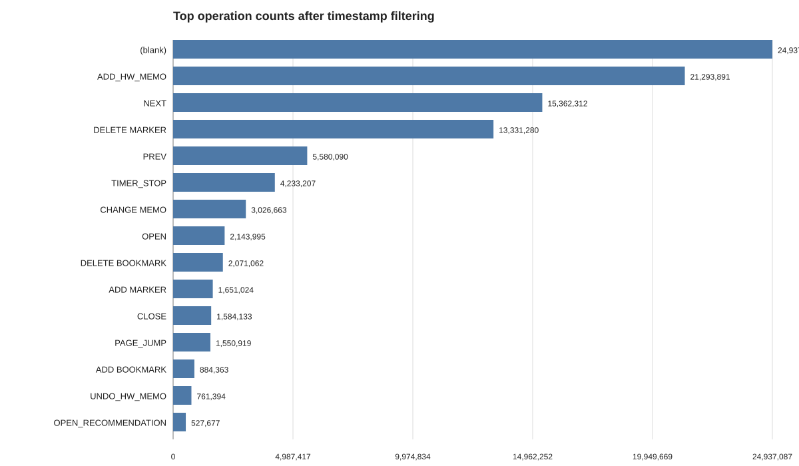
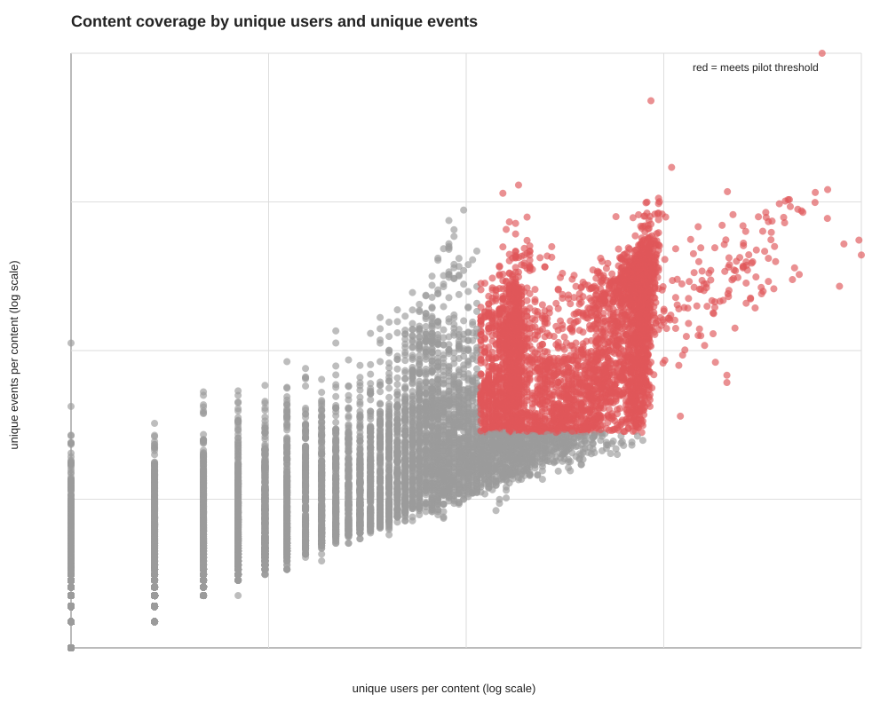
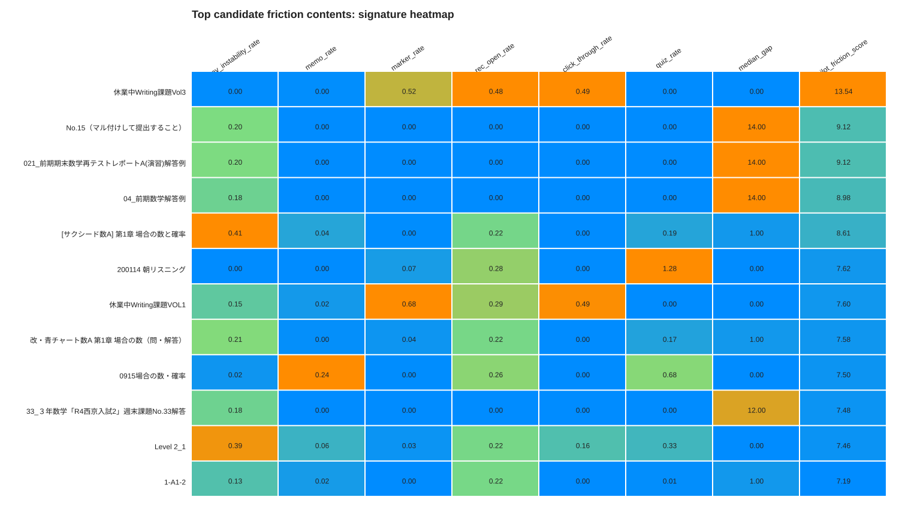
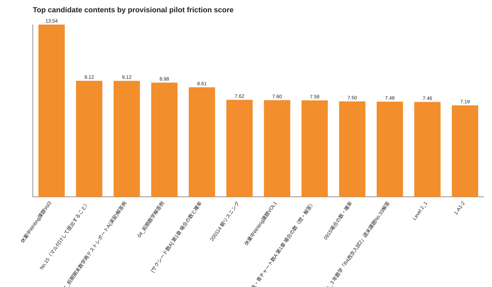
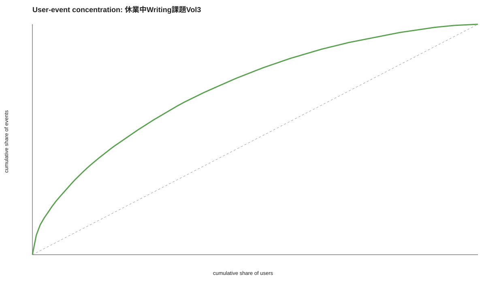
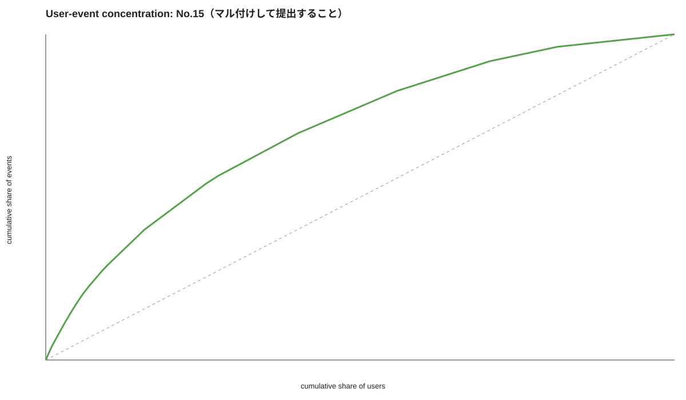
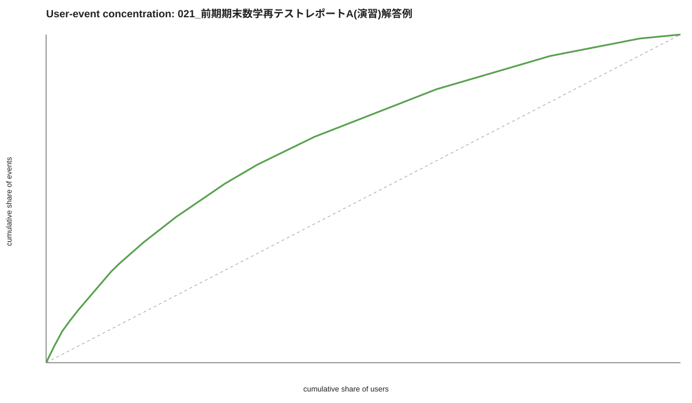

# Pilot analysis results
## Scope
- Database: `saikyo_old.statements_mv`
- This pass is xAPI-only
- Timestamp filter: `2019-01-01` onward, excluding obvious older anomalies
- Content inclusion threshold for the pilot: `uniq_users >= 30` and `uniq_events >= 300`
## Dataset sanity
- Raw filtered rows: **101,749,022**
- Unique `_id`: **58,238,413**
- Duplicate row gap (`count - uniqExact(_id)`): **43,510,609**
- Unique users: **7,939**
- Unique contents: **13,294**
- Unique operations: **43**
- Blank operation rows: **24,937,087**
- Time range after filter: **2019-01-18 00:48:15.000** to **2026-02-13 04:54:14.000**

## Content coverage
- Total contents observed: **13,293**
- Contents meeting pilot threshold: **3,756**
- Median unique users per content: **13.0**
- Median unique events per content: **103.0**

## Top candidate friction contents (provisional)
| Rank | contents_id | contents_name | uniq_users | uniq_events | nav_instability_rate | memo_rate | rec_open_rate | rec_click_through_rate | median_gap | pilot_friction_score |
|---|---:|---|---:|---:|---:|---:|---:|---:|---:|---:|
| 1 | 1b113258af3968aaf3969ca67e744ff8 | 休業中Writing課題Vol3 | 114 | 1202 | 0.0017 | 0.0017 | 0.4775 | 0.4913 | 0.00 | 13.538 |
| 2 | 01ce84968c6969bdd5d51c5eeaa3946a | No.15（マル付けして提出すること） | 102 | 495 | 0.2040 | 0.0000 | 0.0000 | 0.0000 | 14.00 | 9.122 |
| 3 | a9cc6694dc40736d7a2ec018ea566113 | 021_前期期末数学再テストレポートA(演習)解答例 | 78 | 414 | 0.2029 | 0.0000 | 0.0000 | 0.0000 | 14.00 | 9.115 |
| 4 | c3f4db3a634aa769c0f1161219272d03 | 04_前期数学解答例 | 84 | 692 | 0.1777 | 0.0000 | 0.0000 | 0.0000 | 14.00 | 8.976 |
| 5 | f29a179746902e331572c483c45e5086 | [サクシード数A] 第1章 場合の数と確率 | 91 | 5757 | 0.4131 | 0.0358 | 0.2201 | 0.0000 | 1.00 | 8.609 |

### User concentration check: 休業中Writing課題Vol3

### User concentration check: No.15（マル付けして提出すること）

### User concentration check: 021_前期期末数学再テストレポートA(演習)解答例

## Initial interpretation
- This pilot score is a **heuristic ranking**, not a final scientific friction index.
- High-ranking contents tend to combine **navigation instability**, **memo activity**, **recommendation exposure**, and **longer median time gaps**.
- Contents should not be labeled as problematic from a single variable alone. Heavy memo activity may also reflect productive deep engagement.
- The duplicate gap in `_id` means deduplication must stay part of the workflow.
- The next interpretation step requires confirmed content→course→subject/grade mapping from relational metadata.

## What stands out already
- The data-quality issues are substantial, not minor:
  - duplicate row gap after filtering: **43,510,609**
  - blank operation rows: **24,937,087**
- So any later paper-quality analysis must keep deduplication and blank-operation handling explicit.

### Strongest *interpretable* candidate from this pilot
Among the top-ranked contents, the most interpretable friction-style candidate is currently:
- **`[サクシード数A] 第1章 場合の数と確率`**

Why:
- high navigation instability
- heavy page-jump activity
- substantial recommendation-opening activity
- quiz-related activity is also present
- enough users/events to make it worth deeper inspection

This looks closer to a meaningful content-friction signal than a pure system-workflow artifact.

### Candidates that need caution
Some top-ranked contents may reflect workflow or support mechanics rather than straightforward friction.
For example:
- **`休業中Writing課題Vol3`** is dominated by recommendation and marker events
- this may indicate a recommendation-heavy or teacher-designed activity pattern rather than content difficulty alone

Likewise, some math answer/example materials with high `PREV` / `NEXT` rates may reflect answer-checking or review behavior rather than confusion. They are still interesting, but they need course-context interpretation before strong claims.

## Immediate next recommendation
Before going deeper into paper-style claims, the next best step is:
1. keep the current xAPI shortlist
2. map the shortlisted `contents_id` values to course / subject / grade
3. then separate likely categories such as:
   - recommendation-driven workflow content
   - answer/example review content
   - probable friction-heavy learning content
   - annotation-rich but productive deep-reading content
