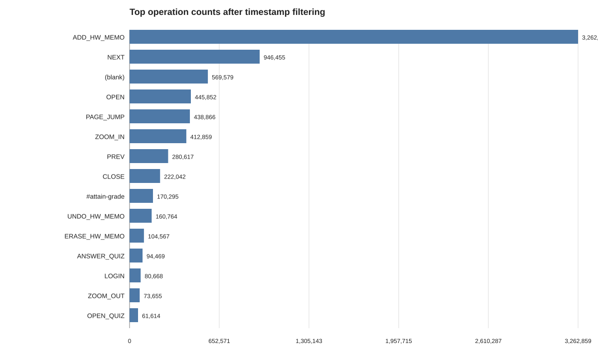
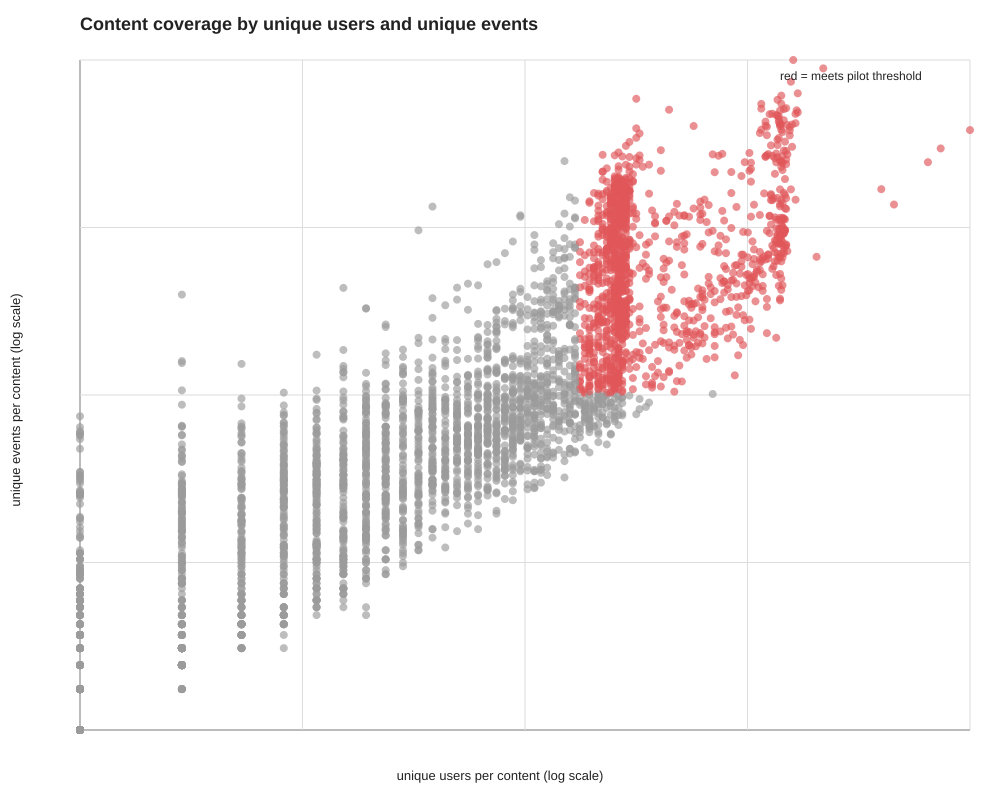
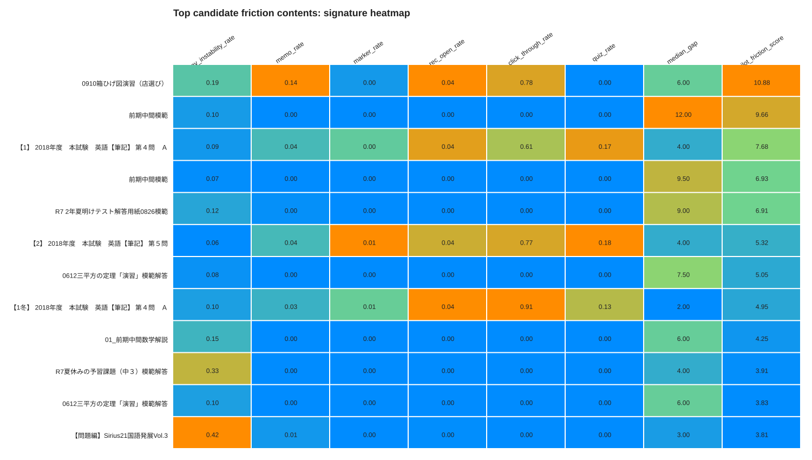
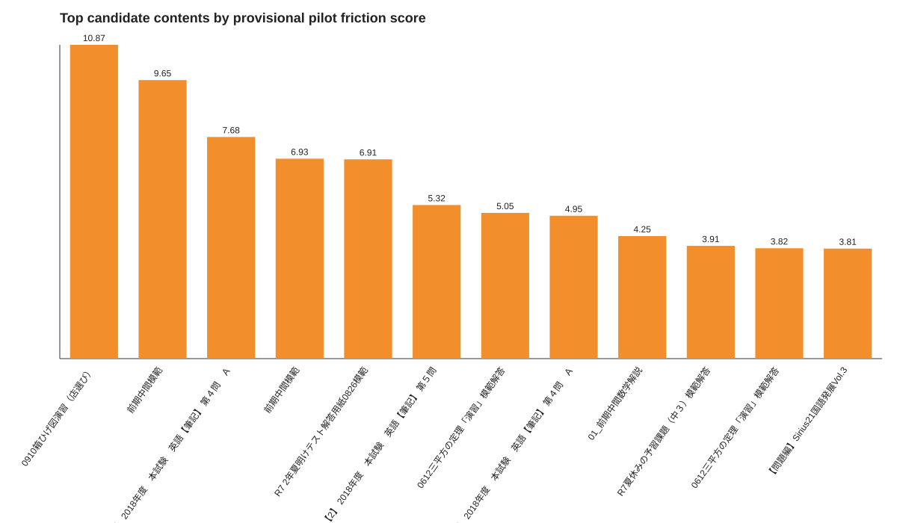
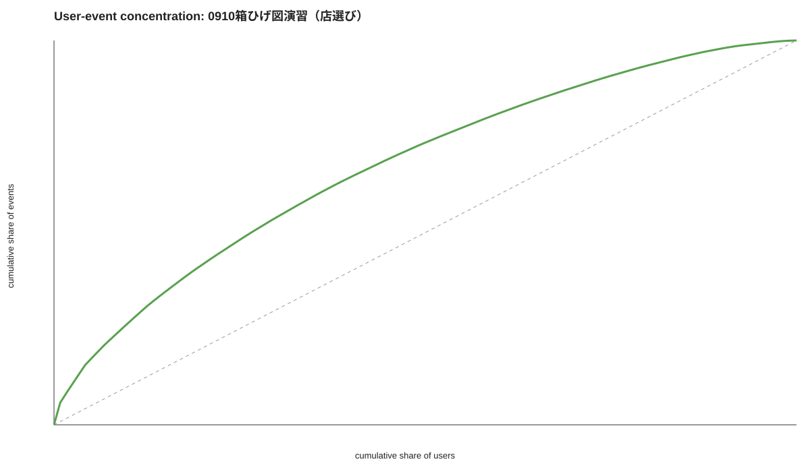
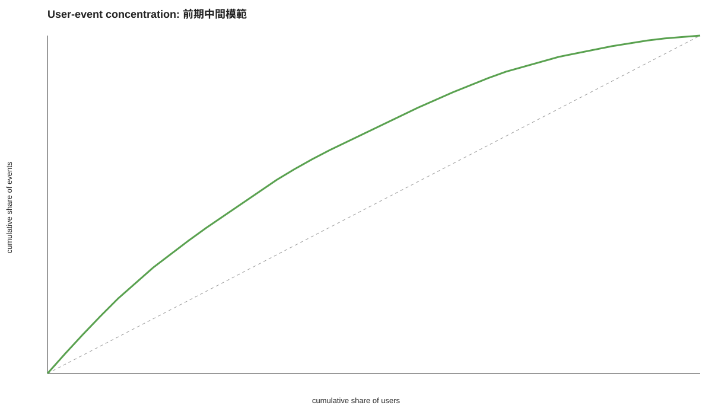
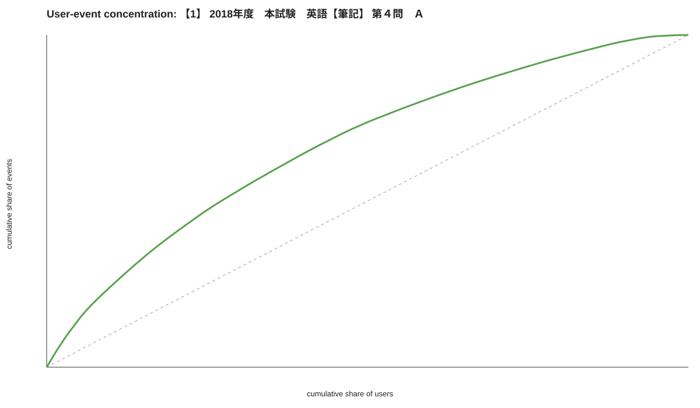

# Pilot analysis results
## Scope
- Database: `saikyo_new.statements_mv`
- This pass is xAPI-only
- Timestamp filter: `2019-01-01` onward, excluding obvious older anomalies
- Content inclusion threshold for the pilot: `uniq_users >= 30` and `uniq_events >= 300`
## Dataset sanity
- Raw filtered rows: **7,672,218**
- Unique `_id`: **7,672,218**
- Duplicate row gap (`count - uniqExact(_id)`): **0**
- Unique users: **2,312**
- Unique contents: **3,969**
- Unique operations: **160**
- Blank operation rows: **569,579**
- Time range after filter: **2023-01-11 23:35:42.000** to **2026-03-30 17:00:29.000**

### Figure 1. Operation mix after filtering

This chart shows the most frequent operation names after timestamp filtering.

## Content coverage
- Total contents observed: **3,968**
- Contents meeting pilot threshold: **1,221**
- Median unique users per content: **16.0**
- Median unique events per content: **193.0**

### Figure 2. Content coverage by users and events

Red points meet the pilot inclusion threshold (`uniq_users >= 30` and `uniq_events >= 300`).

## Top candidate friction contents (provisional)
| Rank | contents_id | contents_name | uniq_users | uniq_events | nav_instability_rate | memo_rate | rec_open_rate | rec_click_through_rate | median_gap | pilot_friction_score |
|---|---:|---|---:|---:|---:|---:|---:|---:|---:|---:|
| 1 | fc192b0c0d270dbf41870a63a8c76c2f | 0910箱ひげ図演習（店選び） | 119 | 3866 | 0.1880 | 0.1368 | 0.0440 | 0.7824 | 6.00 | 10.874 |
| 2 | 1f1baa5b8edac74eb4eaa329f14a0361 | 前期中間模範 | 37 | 478 | 0.0962 | 0.0000 | 0.0000 | 0.0000 | 12.00 | 9.652 |
| 3 | f0f6ba4b5e0000340312d33c212c3ae8 | 【1】 2018年度　本試験　英語【筆記】 第４問　Ａ | 130 | 7950 | 0.0897 | 0.0384 | 0.0390 | 0.6065 | 4.00 | 7.680 |
| 4 | 3fab5890d8113d0b5a4178201dc842ad | 前期中間模範 | 39 | 452 | 0.0664 | 0.0000 | 0.0000 | 0.0000 | 9.50 | 6.927 |
| 5 | daaaf13651380465fc284db6940d8478 | R7 2年夏明けテスト解答用紙0826模範 | 39 | 364 | 0.1181 | 0.0027 | 0.0000 | 0.0000 | 9.00 | 6.905 |

### Figure 3. Friction-signature heatmap for top candidate contents

This heatmap compares the top-ranked contents across the main heuristic features used in the pilot score.

### Figure 4. Top contents by provisional pilot friction score

Higher scores indicate stronger provisional friction signatures under this pilot heuristic.

### Figure 5.1 User concentration check: 0910箱ひげ図演習（店選び）

This plot checks whether the signal is broadly distributed across users or dominated by a small number of heavy users.

### Figure 5.2 User concentration check: 前期中間模範

This plot checks whether the signal is broadly distributed across users or dominated by a small number of heavy users.

### Figure 5.3 User concentration check: 【1】 2018年度　本試験　英語【筆記】 第４問　Ａ

This plot checks whether the signal is broadly distributed across users or dominated by a small number of heavy users.

## Initial interpretation
- This pilot score is a **heuristic ranking**, not a final scientific friction index.
- High-ranking contents tend to combine **navigation instability**, **memo activity**, **recommendation exposure**, and **longer median time gaps**.
- Contents should not be labeled as problematic from a single variable alone. Heavy memo activity may also reflect productive deep engagement.
- The duplicate gap in `_id` means deduplication must stay part of the workflow.
- The next interpretation step requires confirmed content→course→subject/grade mapping from relational metadata.
